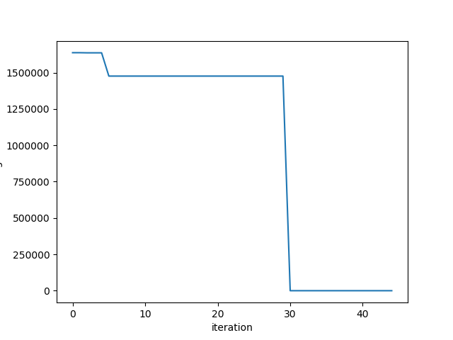

# atividades_IA

## atividade 1

foi utilizado os pacotes *graphviz* e *json*

__para instalar o python-graphviz__
````shell
pip install graphviz
````
__para instalar o python-json__
````shell
pip install json
````

- [x] implementado Iterative Deepening Search
- [x] implementado A __*__
## Projeto Primeira Unidade

- [x] implementado algoritmo genetico
- [ ] relatório :cry:



Gráfico 1: Melhor Indivíduo por interação

### informações sobre a implemntação

parâmetro                |valor ou atributo escolhido
-------------------------|---------------------------
codificação              | pro valor
tipo de seleção          | Torneio
tipo de cruzamento       | Cruzamento Multi-Pontos
tipo de substituição     | Substituição com estado fixo
taxa de cruzamento       | 2/3 da população total
tamanho da população     | 5 indivíduos
taxa de mutação          | 0.03
Critéiro de parada       | Melhor Individuo atingir o valor esperado