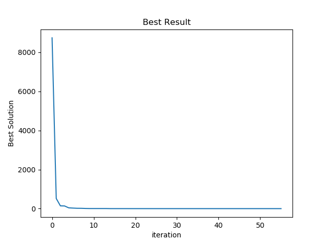

# atividades_IA

## atividade 1

foi utilizado os pacotes *graphviz* e *json*

__para instalar o python-graphviz__
````shell
pip install graphviz
````
__para instalar o python-json__
````shell
pip install json
````

- [x] implementado Iterative Deepening Search
- [x] implementado A __*__
## Projeto Primeira Unidade

- [x] implementado algoritmo genetico
- [x] implementado Simulated Annealing ( Recozimento Simulado)
- [ ] relatório :cry:


### informações sobre a implemntação do algoritmo genetico

parâmetro                          |valor ou atributo escolhido
-----------------------------------|---------------------------
Codificação                        | Pro valor
Tipo de seleção                    | Torneio
Tipo de cruzamento                 | Cruzamento Multi-Pontos
Tipo de substituição               | Substituição com estado fixo
Taxa de cruzamento                 | 2/3 da população total
Tamanho da população               | 5 indivíduos
Taxa de mutação                    | 0.03
Critéiro de parada                 | Melhor Indivíduo atingir o valor esperado
__*__ Média de interações          | 3315 interações
__*__ Desvio padrão                | 1029 interações

__*__ foram executadas 100 vezes o algoritmo nas mesmas condições para  
serem geradas as informações marcadas com __*__

### informações sobre a implemntação do Simulated Annealing  
parâmetro                          |valor ou atributo 
-----------------------------------|------------------
temperatura inicial                | 100
temperatura final                  | 0.000001
número máximo de vizinhos          | 50
fator de redução da temperatura    | 0.999
__*__ Média de interações          | 168 interações
__*__ Desvio padrão                | 53 interações  

__*__ foram executadas 100 vezes o algoritmo nas mesmas condições para  
serem geradas as informações marcadas com __*__  

  
  
__Gráfico 1:__ Melhor Indivíduo por interação (algoritmo genético).  

  
  
__Gráfico 2:__ Melhor solução pro interação ( Recozimento Simulado )  

#### OBS:
Das 100 vezes executadas os algoritmos. Foi escolhido os melhores resultados  
em relação ao número de interações para plotar o gráfico. Ou seja a mais rapida  
execução do algoritmo genetico foi plotada no [gráfico 1](#grafico1).  
A melhor execução do Recozimento Simulado foi plotada no [gráfico 2](#grafico2)